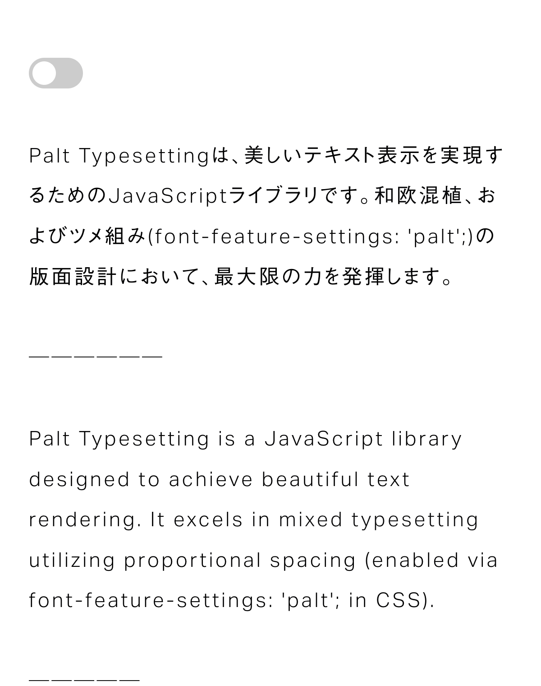

# Palt Typesetting

## Typesetting Library for Proportional Spacing



Palt Typesetting は、美しいテキスト表示を実現するための JavaScript ライブラリです。和欧混植、およびツメ組み (`font-feature-settings: 'palt'`) の版面設計において、最大限の力を発揮します。

四分アキの自動挿入、カーニングルールの適用、英語のような単語区切りでの改行など、洗練された組版機能を提供します。

## Demo

- [Interactive Demo](https://palt.typesetting.jp)
- [Try on CodePen](https://codepen.io/yamatoiizuka-the-animator/pen/PoLGrZe)

## Getting Started

### Install from NPM

```shell
npm install palt-typesetting
```

```javascript
import Typesetter from 'palt-typesetting'

// Typesetter のインスタンスを作成
const typesetter = new Typesetter()

// セレクターにマッチする要素に対して組版を適用
typesetter.renderToSelector('.my-class')
```

### Use Typesetter from CDN

```html
<script src="https://unpkg.com/palt-typesetting@0.2.1/bundle/typesetter.min.js"></script>
```

```html
<script>
  // Typesetter のインスタンスを作成
  const typesetter = new Typesetter()

  // セレクターにマッチする要素に対して組版を適用
  typesetter.renderToSelector('.my-class')
</script>
```

### Apply CSS (Example)

```css
/*
 * 共通のスタイリング
 */
.typeset {
  /* プロポーショナルメトリクス（ツメ組み）の設定 */
  font-feature-settings: 'palt';

  /* 行間 */
  line-height: 1.8;

  /* 文字間 */
  letter-spacing: 0.1em;

  /*
   * Safari のフォントレンダリング対策。
   * 英数（.typeset-latin）で -webkit-text-stroke を使う場合は必須。
   * text-stroke-weight > 0, text-stroke-color: transparent
   */
  -webkit-text-stroke: 0.01em transparent;
}

/*
 * 英数のみのスタイリング
 */
.typeset-latin {
  /* フォントの拡大・縮小 */
  font-size: 105%;

  /* ベースラインの調整 */
  vertical-align: 0.02em;

  /*
   * 行間の調整。親要素 .typeset の行間と視覚的に合わせます。
   * [.typeset の line-height] ÷ [フォントの拡大率] - [ベースラインの調整値の絶対値] × 2 
   */
  line-height: calc(1.8 / 1.05 - 0.02 * 2);

  /* 文字間の調整 */
  letter-spacing: 0.05em;

  /* 文字の細らせ・太らせ */
  -webkit-text-stroke: 0.01em #000;
}
```

## Typesetter Class

### Usage

```javascript
// Typesetter のインスタンスを作成
const typesetter = new Typesetter()

// セレクターにマッチする要素に対して組版を適用
typesetter.renderToSelector('div')
typesetter.renderToSelector('.my-class')
typesetter.renderToSelector('#my-id')

// HTML 要素に組版を適用
const elements = document.querySelectorAll('.my-class')
typesetter.renderToElements(elements)

// 組版を適用した HTML の取得
const srcHtml = '「日本語」とEnglish'
console.log(typesetter.render(srcHtml))
// <span class="typeset" /* 中略 */>「日本語」<span class="typeset-thin-space" style="font-size: 100%;" /* 中略 */> </span><wbr>と<span class="typeset-thin-space" style="font-size: 100%;" /* 中略 */> </span><wbr><span class="typeset-latin">English</span></span>
```

### Constructor

| コンストラクタ         | 説明                                                                                                  | 引数                            |
| ---------------------- | ----------------------------------------------------------------------------------------------------- | ------------------------------- |
| `Typesetter(options?)` | Typesetter インスタンスを作成します。<br>オプションを指定することでカスタムの組版設定を適用できます。 | `options`: オプション（任意）。 |

### Methods

| メソッド名                   | 説明                                                                  | 引数                                                         | 戻り値                                   |
| ---------------------------- | --------------------------------------------------------------------- | ------------------------------------------------------------ | ---------------------------------------- |
| `render(srcHtml)`            | スタイルを適用した HTML 文字列を返します。                            | `srcHtml`: 処理する HTML 文字列                              | `string`: スタイルを適用した HTML 文字列 |
| `renderToElements(elements)` | 指定された Element または Element の配列にスタイルを適用します。      | `elements`: スタイルを適用する Element または Element の配列 | `void`                                   |
| `renderToSelector(selector)` | 指定された CSS セレクタに一致するすべての要素にスタイルを適用します。 | `selector`: スタイルを適用する要素を選択する CSS セレクタ    | `void`                                   |

## Options

### Usage

```javascript
const options = {
  // ライブラリで使用される CSS クラス名のプレフィックスを指定します。
  classNamePrefix: 'typeset',

  // 単語や助詞など、単語区切りでの改行を行います。
  useWordBreak: true,

  // 英数を `.typeset-latin` でラップします。
  wrapLatin: true,

  // 罫線などの分離禁則文字を `.typeset-no-breaks` でラップし、文字間を 0 に設定します。
  noSpaceBetweenNoBreaks: true,

  // 四分アキスペースを自動で挿入します。
  insertThinSpaces: true,

  // 四分アキスペースの幅を設定します。
  thinSpaceWidth: '100%',

  // 特定の文字間のカーニングルールを設定します。
  kerningRules: [
    {
      between: ['す', '。'],
      value: '-80',
    },
    {
      between: ['で', '、'],
      value: '-120',
    },
  ],
}

const typeset = new Typesetter(options)
typesetter.renderToSelector('.my-class')
```

### Typesetting Options

| オプション名             | 説明                                                                                                                                       | 型                                                       | デフォルト値 |
| ------------------------ | ------------------------------------------------------------------------------------------------------------------------------------------ | -------------------------------------------------------- | ------------ |
| `classNamePrefix`        | ライブラリで使用される CSS クラス名のプレフィックスを指定します。                                                                          | `string`                                                 | `'typeset' ` |
| `useWordBreak`           | 単語や助詞など、単語区切りでの改行を行います。                                                                                             | `boolean`                                                | `true`       |
| `wrapLatin`              | 英数を `span.typeset-latin` でラップします。<br>`useWordBreak` が `true` の場合にのみ有効です。                                            | `boolean`                                                | `true`       |
| `noSpaceBetweenNoBreaks` | 罫線などの分離禁則文字を `span.typeset-no-breaks` でラップし、文字間を 0 に設定します。<br>`useWordBreak` が `true` の場合にのみ有効です。 | `boolean`                                                | `true`       |
| `insertThinSpaces`       | 四分アキスペースを自動で挿入します。                                                                                                       | `boolean`                                                | `true`       |
| `thinSpaceWidth`         | 四分アキスペースの幅を設定します。<br>`insertThinSpaces` が `true` の場合にのみ有効です。                                                  | `string`                                                 | `'100%' `    |
| `kerningRules`           | 特定の文字間のカーニングルールを設定します。                                                                                               | `{between: [string, string], value: string \| number}[]` | `[]`         |

## Notes

### 環境要件

Palt Typesetting ライブラリは、テキストを言語固有のセグメントに分割する `Intl.Segmenter` という機能に依存しています。そのため、以下の環境要件があります。

- Node.js: 16.0.0 以上
- ブラウザ: Intl.Segmenter をサポートしているブラウザ

クライアントサイドで実行する場合、この機能は一部のブラウザで利用できません。Palt Typesetting ライブラリは、Firefox などの `Intl.Segmenter` がサポートされていない環境[^1] では組版処理をスキップし、元のテキストをそのまま返します。全てのモダンブラウザで同様の見え方を再現するには、サーバーサイドでの処理（SSG など）が必要になります。

`Intl.Segmenter` の対応状況については、[Can I use...](https://caniuse.com/?search=Intl.Segmenter) で確認できます。

[^1]: Firefox では、バージョン 125 から Intl.Segmenter のサポートが予定されています。

### 注意事項

Palt Typesetting ライブラリは HTML 入力をサポートしていますが、入力された HTML をサニタイズする機能は**含まれていません**。 入力を信頼できない場合は、適切なサニタイザライブラリと共に使用することを強く推奨します。

## Author

飯塚 大和 (Yamato Iizuka)
