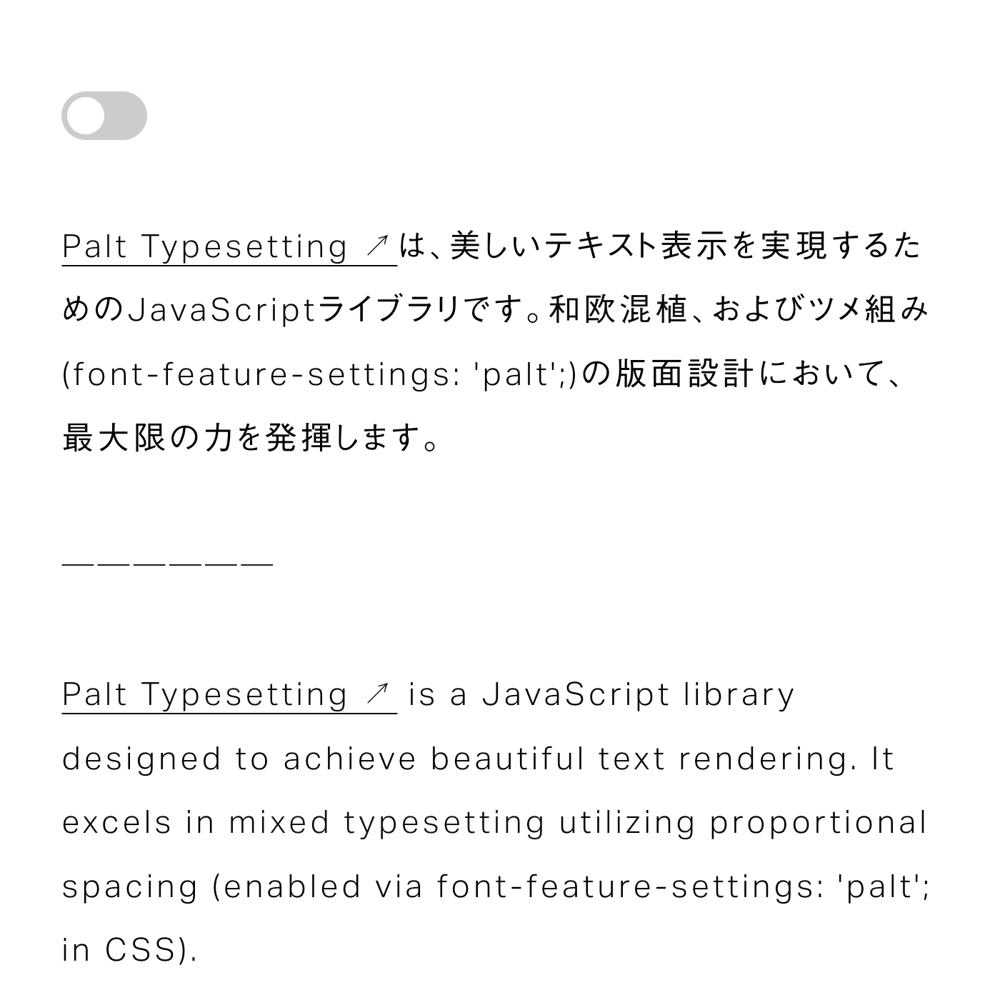

# Palt Typesetting

## Typesetting Library for Proportional Spacing



Palt Typesetting は、美しいテキスト表示を実現するための JavaScript ライブラリです。和欧混植、およびツメ組み (`font-feature-settings: 'palt'`) の版面設計において、最大限の力を発揮します。

四分アキの自動挿入、カーニングルールの適用、英語のような単語区切りでの改行など、洗練された組版機能を提供します。

## Demo

- [Interactive Demo](https://palt.typesetting.jp)
- [Try on CodePen](https://codepen.io/yamatoiizuka-the-animator/pen/PoLGrZe)

---

## Getting Started

### Install from NPM

npm でパッケージをインストールする場合

```shell
npm install palt-typesetting
```

```javascript
import Typesetter from 'palt-typesetting'
import 'palt-typesetting/dist/typesetter.css'

// Typesetter のインスタンスを作成
const typesetter = new Typesetter()

// セレクターにマッチする要素に対して組版を適用
typesetter.renderToSelector('.my-class')
```

### Use from CDN

WordPress や jQuery などの環境で使用する場合

```html
<head>
  <!-- head タグ内でスタイルの読み込み -->
  <link rel="stylesheet" type="text/css" href="https://unpkg.com/palt-typesetting@0.6.2/bundle/typesetter.min.css" />
</head>

<body>
  <!-- body 閉じタグの前でスクリプトの読み込み -->
  <script src="https://unpkg.com/palt-typesetting@0.6.2/bundle/typesetter.min.js"></script>
</body>
```

```html
<script>
  // Typesetter のインスタンスを作成
  const typesetter = new Typesetter()

  // セレクターにマッチする要素に対して組版を適用
  typesetter.renderToSelector('.my-class')
</script>
```

### Apply Custom CSS

生成された組版用 HTML にカスタム CSS を適用

```css
/**
 * 共通のスタイリング（例）
 */
.typesetting-wrapper {
  /* プロポーショナルメトリクス（ツメ組み）の設定 */
  font-feature-settings: 'palt';

  /* 行間 */
  line-height: 1.8;

  /* 文字間 */
  letter-spacing: 0.1em;

  /**
   * Safari のフォントレンダリング対策。
   * 英数（.typesetting-latin）で -webkit-text-stroke を使う場合は必須。
   * text-stroke-weight > 0, text-stroke-color: transparent
   */
  -webkit-text-stroke: 0.01em transparent;
}

/**
 * 英数のみのスタイリング（例）
 */
.typesetting-latin {
  /* フォントの拡大・縮小 */
  font-size: 105%;

  /* ベースラインの調整 */
  vertical-align: 0.02em;

  /**
   * 行間の調整。親要素 .typesetting-wrapper の行間と視覚的に合わせます。
   * [.typesetting-wrapper の line-height] ÷ [フォントの拡大率] - [ベースラインの調整値の絶対値] × 2 
   */
  line-height: calc(1.8 / 1.05 - 0.02 * 2);

  /* 文字間の調整 */
  letter-spacing: 0.05em;

  /* 文字の細らせ・太らせ */
  -webkit-text-stroke: 0.01em #000;
}
```

---

## Typesetter Class

Palt Typesetting では、Typesetter クラスを使用して HTML テキストに組版を適用します。  
ライブラリの機能はオプションを通じてカスタマイズできます。

### サンプルコード

```javascript
/**
 * options: TypesettingOptions
 * オプションの設定
 */
const options = {
  // 単語や助詞など、単語区切りでの改行を行います。
  useWordBreak: true,

  // 英数を `.typesetting-latin` でラップします。
  wrapLatin: true,

  // 罫線などの分離禁則文字を `.typesetting-no-breaks` でラップし、文字間を 0 に設定します。
  noSpaceBetweenNoBreaks: true,

  // 四分アキスペースを自動で挿入します。
  insertThinSpaces: true,

  // 四分アキスペースの幅を設定します。
  thinSpaceWidth: '0.2em',

  // 特定の文字間のカーニングルールを設定します。
  kerningRules: [
    {
      between: ['し', 'ま'],
      value: '60',
    },
    {
      between: ['す', '。'],
      value: '-80',
    },
  ],
}

/**
 * Typesetter(options?: TypesettingOptions)
 * インスタンスの作成
 */
const typesetter = new Typesetter(options)

/**
 * renderToSelector(selector: string): void
 * セレクターにマッチする要素に対して組版を適用
 */
typesetter.renderToSelector('div')
typesetter.renderToSelector('.my-class')
typesetter.renderToSelector('#my-id')

/**
 * renderToElements(elements: string): void
 * HTML 要素に組版を適用
 */
const elements = document.querySelectorAll('.my-class')
typesetter.renderToElements(elements)

/**
 * render(srcHtml: string): string
 * 組版を適用した HTML の取得
 */
const srcHtml = '「日本語」とEnglish'
console.log('output: ' + typesetter.render(srcHtml))
// output: <span class="typeset typesetting-wrapper typesetting-word-break">「日本語」<span class="typesetting-thin-space" style="letter-spacing: 0.2em;" data-content=" "></span>と<span class="typesetting-thin-space" style="letter-spacing: 0.2em;" data-content=" "></span><span class="typesetting-latin">English </span></span>
```

### コンストラクタ

| コンストラクタ         | 説明                                                                                                  | 引数の型                       |
| ---------------------- | ----------------------------------------------------------------------------------------------------- | ------------------------------ |
| `Typesetter(options?)` | Typesetter インスタンスを作成します。<br>オプションを指定することでカスタムの組版設定を適用できます。 | `options?: TypesettingOptions` |

### メソッド

| メソッド名                   | 説明                                                                  | 引数の型               | 戻り値の型 |
| ---------------------------- | --------------------------------------------------------------------- | ---------------------- | ---------- |
| `render(srcHtml)`            | スタイルを適用した HTML 文字列を返します。                            | `string`               | `string`   |
| `renderToElements(elements)` | 指定された Element または Element の配列にスタイルを適用します。      | `Element \| Element[]` | `void`     |
| `renderToSelector(selector)` | 指定された CSS セレクタに一致するすべての要素にスタイルを適用します。 | `string`               | `void`     |

### オプション

| オプション名             | 説明                                                                                        | オプションの型                                                                | デフォルト値 |
| ------------------------ | ------------------------------------------------------------------------------------------- | ----------------------------------------------------------------------------- | ------------ |
| `useWordBreak`           | 単語や助詞など、単語区切りでの改行を行います。                                              | `boolean`                                                                     | `true`       |
| `wrapLatin`              | 英数を `span.typesetting-latin` でラップします。                                            | `boolean`                                                                     | `true`       |
| `noSpaceBetweenNoBreaks` | 罫線などの分離禁則文字を `span.typesetting-no-breaks` でラップし、文字間を 0 に設定します。 | `boolean`                                                                     | `true`       |
| `insertThinSpaces`       | 四分アキスペースを自動で挿入します。                                                        | `boolean`                                                                     | `true`       |
| `thinSpaceWidth`         | 四分アキスペースの幅を設定します。`insertThinSpaces: true` のときのみ有効です。             | `string`                                                                      | `'0.2em' `   |
| `kerningRules`           | 特定の文字間のカーニングルールを設定します。                                                | `{`<br>`　between: [string, string],`<br>`　value: string \| number`<br>`}[]` | `[]`         |

### 生成される CSS クラス

| CSS クラス名              | 説明                                                           | オプションによる生成の条件     |
| ------------------------- | -------------------------------------------------------------- | ------------------------------ |
| `.typesetting-wrapper`    | ソースとなる HTML 文字列中のテキストコンテンツをラップします。 | 常に生成                       |
| `.typesetting-word-break` | ソースとなる HTML 文字列中のテキストコンテンツをラップします。 | `useWordBreak: true`           |
| `.typesetting-latin`      | テキストコンテンツ中の英数をラップします。                     | `wrapLatin: true`              |
| `.typesetting-no-breaks`  | テキストコンテンツ中の分離禁則文字をラップします。             | `noSpaceBetweenNoBreaks: true` |
| `.typesetting-thin-space` | 挿入される四分アキスペースエレメントの CSS クラスです。        | `insertThinSpaces: true`       |
| `.typesetting-kerning`    | 挿入されるカーニングエレメントの CSS クラスです。              | 有効な `kerningRules` が存在   |

---

## for Typescript

TypeScript の型定義を提供しています。完全な型定義は[こちら](https://github.com/yamatoiizuka/palt-typesetting/blob/main/types/index.d.ts)をご参照ください。

### サンプルコード

```typescript
import Typesetter from 'palt-typesetting'
import type { TypesettingOptions, KerningRule } from 'palt-typesetting/types'
import 'palt-typesetting/dist/typesetter.css'

const kerning: KerningRule[] = [
  {
    between: ['し', 'ま'],
    value: '60',
  },
]

const options: TypesettingOptions = {
  thinSpaceWidth: '0.25em',
  kerningRules: kerning,
}

const typeset = new Typesetter(options)
typesetter.renderToSelector('.my-class')
```

---

## for Frameworks

モダンな JavaScript フレームワーク用のサンプル集です。

### Astro.js

Typesetting コンポーネントの作成

`components/Typesetting.astro`

```astro
---
import Typesetter from 'palt-typesetting'
import 'palt-typesetting/dist/typesetter.css'

const { src } = Astro.props
const slot = await Astro.slots.render('default')
const content = src || slot || ''

const typesetter = new Typesetter();
---

<!-- content が空でなければ組版を適用 -->
{content && <Fragment set:html={typesetter.render(content)} />}

<style is:global>
  /* 合成フォントのイメージでスタイルを設定 */

 .typesetting-wrapper {
  font-feature-settings: 'palt';
  line-height: 1.8;
  letter-spacing: 0.1em;
  /* ...その他のスタイル */
}

.typesetting-latin {
  font-size: 105%;
  letter-spacing: 0.05em;
  /* ...その他のスタイル */
}
</style>
```

Typesetting コンポーネントの読み込み

`pages/index.astro`

```astro
---
import Typeset from '../components/Typesetting.astro'
---

<div>
  <!-- props を使った書き方 -->
  <Typesetting src="「日本語」とEnglish、晴れ・28度。" />

  <!-- slot を使った書き方 -->
  <Typesetting>
    <a href="../">トップページ</a>
  </Typesetting>
</div>

<style>
 p {
  font-size: 1.8rem;
 }
</style>
```

---

## Notes

### 環境要件

Palt Typesetting ライブラリは、テキストを言語固有のセグメントに分割する `Intl.Segmenter` という機能に依存しています。そのため、以下の環境要件があります。

**SSG など、サーバーサイドで実行する場合**

- Node.js 16.0.0 以上

**クライアントサイドで実行する場合**

- Intl.Segmenter をサポートしているブラウザ

クライアントサイドで実行する場合、この機能は一部のブラウザで利用できません。Palt Typesetting ライブラリは、Firefox などの `Intl.Segmenter` がサポートされていない環境[^1] では、`useWordBreak`（単語区切りでの改行）と `insertThinSpaces`（四分アキの自動挿入）オプションがスキップされます。全てのモダンブラウザで同様の見え方を再現するには、サーバーサイドでの事前処理（SSG など）が必要となります。

`Intl.Segmenter` の対応状況については、[Can I use...](https://caniuse.com/?search=Intl.Segmenter) で確認できます。

[^1]: Firefox では、バージョン 125 から Intl.Segmenter のサポートが予定されています。

### 注意事項

Palt Typesetting ライブラリは HTML 入力をサポートしていますが、入力された HTML をサニタイズする機能は**含まれていません**。 入力を信頼できない場合は、適切なサニタイザライブラリと共に使用することを強く推奨します。

## Author

[飯塚 大和 (Yamato Iizuka)](https://yamatoiizuka.com)
